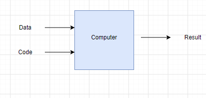
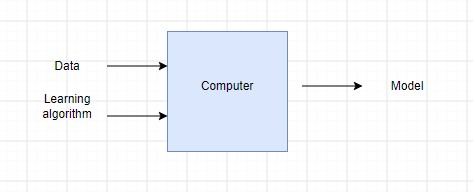
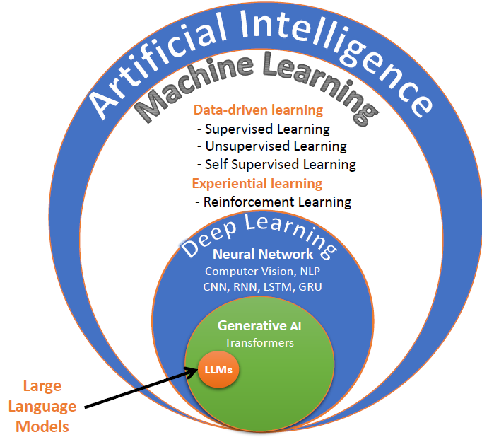

# # 📚 Chapitre 3 — Machine Learning (ML)

### 1. Introduction 

Le **Machine Learning (ML)** marque un changement de paradigme total par rapport à la programmation traditionnelle.
- ML est une branche de l'intelligence artificielle qui **permet aux machines d'apprendre à partir de données**,
sans être explicitement programmées pour chaque tâche.

---

#### 🧠 2. La Programmation Traditionnelle vs Le Machine Learning

- 
>Tu donnes des Règles (le **code**) et des **Données (Data)** à l'ordinateur (**Computer**), et il te sort des **Résultats**. Exemple : Si score > 50, alors afficher "Réussi".

- 
> Tu donnes des **Données (Data-Features)** et **les Résultats attendus (ou observés-Label ou Target). Learning algorithm** à l'ordinateur.
L'algorithme cherche le lien logique entre les deux et générer de manière autonome un **Model (Modèle)**.
Exemple : Tu lui donnes 10 000 photos de chats et 10 000 photos de chiens en lui disant qui est quoi.
**Le modèle** trouve les caractéristiques visuelles (les règles) pour les différencier tout seul

#### 📝 2.1. Le processus interne d'apprentissage (The Fitting Process)

**Comment la machine fait-elle pour "apprendre" ?**

Elle suit un processus mathématique itératif en 3 étapes :
1. **L'Inférence (Inference / Prediction)** : Au départ, le modèle a des paramètres mathématiques (poids) aléatoires. On lui donne une **Feature $X$**) et il fait une prédiction au hasard $\hat{Y}$).
2. **Le Calcul de l'Erreur (Loss Function)** : Le modèle compare sa prédiction $\hat{Y}$) avec la **Ground Truth** (la vérité terrain, la vraie valeur historique $Y$). Il mesure mathématiquement la distance de son erreur.
3. **L'Optimisation (Optimization)** : L'algorithme ajuste légèrement ses poids internes pour réduire l'erreur lors de la prochaine tentative.


#### 🛠️ 2.2. À quoi ça sert ?(Les cas d'usage réels).
Le ML excelle là où l'humain ne peut pas écrire de règles explicites : 
- prédiction des prix de l'immobilier, 
- détection de fraudes bancaires, 
- reconnaissance vocale, 
- ou encore conduite autonome.

#### 🏷️ 2.3. C'est quoi les "données étiquetées" (Labeled Data).

Une donnée **étiquetée**, c'est tout simplement une donnée qui contient la réponse finale (**Label / Target**) que l'on cherche à prédire.

Imagine que tu es un professeur et que tu prépares un examen.
- Une donnée non-étiquetée, c'est la question de l'exercice toute seule.
- Une donnée étiquetée, c'est la question **ACCOMPAGNÉE de son corrigé** (la bonne réponse).

##### 🛠️ Exemple concret avec un tableau (**Dataset**) :
Imaginons qu'on veuille prédire le prix d'une maison. Ton fichier de données ressemble à ça :

| Surface (m²) | Nombre de chambres | Ville     | Prix (€)                   |
|--------------|--------------------|-----------|----------------------------|
| 50           | 1                  | Paris     | **450 000** (Ground Truth) |
| 120          | 3                  | Lyon      | **600 000** (Ground Truth) |
| 85           | 2                  | Marseille | **350 000** (Ground Truth) |

- **Les Caractéristiques (Features $X$)** : La surface, les chambres, la ville. Ce sont les indices.
-  **L'Étiquette (Label ou Target $Y$)** : Le **Prix (€)**. La cible à prédire (la réponse).
-  **Ground Truth** : La vérité terrain (la vraie valeur historique du tableau).
> Si ton tableau contient la colonne "Prix", tes données sont **étiquetées (Labeled Data)**. Si tu caches la colonne "Prix" et que la machine doit se débrouiller seule, les données sont **non-étiquetées (no Labeled Data)**.

---

### 3. 🕹️ Les Approches et Typologies du Machine Learning

```text
📌 MACHINE LEARNING 
 │
 ├── 📊 A. Approche PILOTÉE PAR LES DONNÉES (Data-Driven)
 │    │    Spécification : Exploitation de jeux de données (Datasets) historiques.
 │    │
 │    ├── 🟢 1. Supervised Learning (Apprentissage Supervisé) 
 │    │    │    Condition : Les données sont ÉTIQUETÉES (Présence de Features X et de Labels Y).
 │    │    │
 │    │    ├── 📈 Spécialisation : Régression (Regression)
 │    │    │    └─ Objectif : Prédire une valeur numérique continue (ex: Prix d'une maison, température).
 │    │    │
 │    │    └── 🏷️ Spécialisation : Classification
 │    │         └─ Objectif : Prédire une catégorie ou une classe discrète (ex: Spam vs Non-Spam, Chien vs Chat).
 │    │
 │    ├── 🔵 2. Unsupervised Learning (Apprentissage Non-Supervisé)
 │    │    │    Condition : Les données sont NON-ÉTIQUETÉES (Présence de Features X uniquement, pas de Label Y).
 │    │    │
 │    │    ├── 👥 Spécialisation : Clustering (Segmentation)
 │    │    │    └─ Objectif : Regrouper des données similaires entre elles (ex: Groupes de clients e-commerce).
 │    │    │
 │    │    └── 📉 Spécialisation : Réduction de Dimensionnalité (Dimensionality Reduction)
 │    │         └─ Objectif : Simplifier un dataset complexe en résumant ses variables sans perdre d'information.
 │    │
 │    └── 🟡 3. Self-Supervised Learning (Apprentissage Auto-Supervisé)
 │         │    Condition : Données brutes massives sans étiquettes humaines.
 │         │    └─ Mécanisme : Le modèle masque une partie du jeu de données pour l'utiliser comme Label (ex: Prédire le mot suivant dans un texte).
 │
 └── 🎮 B. Approche PILOTÉE PAR L'EXPÉRIENCE (Experience-Driven)
      │    Spécification : Pas de Dataset fixe au départ. Apprentissage dynamique en temps réel.
      │
      └── 🔴 1. Reinforcement Learning (Apprentissage par Renforcement)
           │    Mécanisme : Un Agent évolue dans un Environnement. Il prend des décisions et reçoit des Récompenses (Rewards) ou des Pénalités.
           │
           ├── 🤖 Spécialisation : Modèle Isolé (Single Agent)
           │    └─ Objectif : Automatisation d'une tâche unique par un seul système autonome (ex: Robot aspirateur).
           │
           └── 🌐 Spécialisation : Systèmes Multi-Agents (Multi-Agent Systems - MAS)
                └─ Objectif : Intelligence collective distribuée où plusieurs Agents collaborent ou s'affrontent (ex: Gestion de flottes de drones, trading algorithmique haute fréquence).
```

---

### 🔄 4. Le Cycle de vie d'un Projet ML (ML Lifecycle)

1. **Data Collection :** Collecte des données brutes (Fichiers, Bases de données, APIs).
2. **Data Cleaning / Preprocessing :** Traitement des valeurs manquantes, nettoyage des anomalies (70% à 80% du temps d'un projet).
3. **Feature Engineering :** Sélection, transformation et création de nouvelles colonnes stratégiques pour optimiser l'apprentissage.
4. **Model Fitting :** Phase d'exécution de l'algorithme sur le Dataset pour générer le modèle ajusté.
5. **Model Evaluation :** Mesure des performances et de la capacité de généralisation sur des données de test non vues.
6. **Deployment :** Intégration du modèle finalisé en production (mise à disposition via une API).

---

#### Machine Learning, IA, Deep Learning et Data Science
Ces quatre termes se recoupent et prêtent à confusion. Voici comment les situer :

| Terme                         | Ce que c'est                                   | Relation                                   |
|-------------------------------|------------------------------------------------|--------------------------------------------|
| **Intelligence artificielle** | Tout système qui imite une capacité humaine    | L'ensemble le plus large.                  | 
| **Machine learning**          | Apprendre des règles à partir de données       | Un sous-ensemble de l'IA.                  |
| **Deep learning**             | ML fondé sur des réseaux de neurones profonds  | Un sous-ensemble du ML (images/son/texte). | 
| **Data science**              | Extraire de la valeur des données (dont le ML) | Une discipline globale qui utilise le ML.  | 

> Le **Deep Learning** utilise des réseaux de neurones à plusieurs couches, très performants sur les données non structurées (images, son, texte), mais gourmands en calcul. Pour la plupart des problèmes tabulaires (fichiers, bases de données), un modèle de **Machine Learning classique** suffit, s'entraîne plus vite (**Fit**) et reste plus simple à expliquer.

Seen visually:


